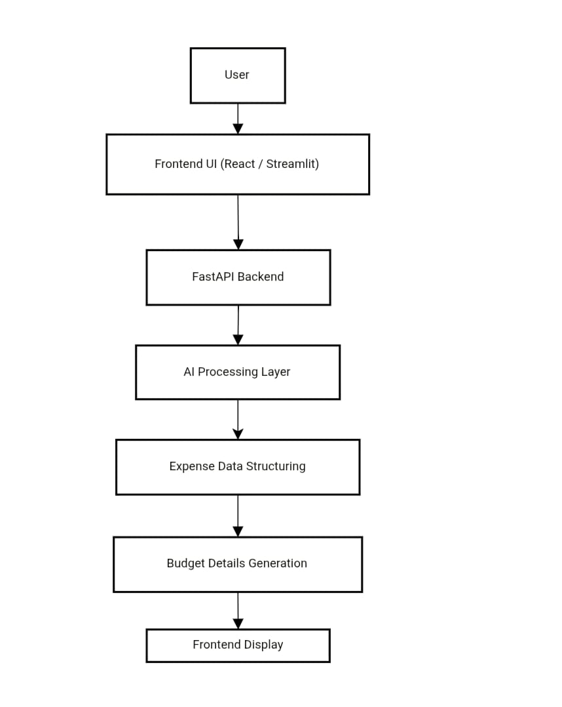
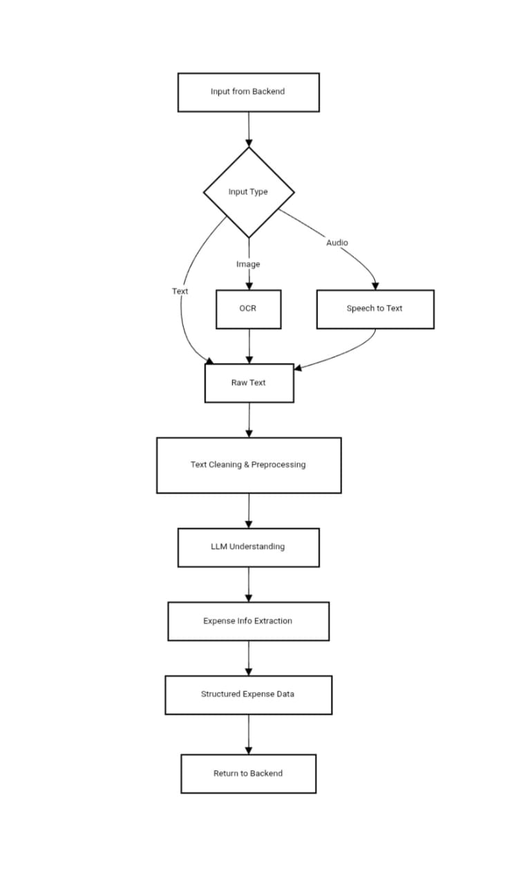
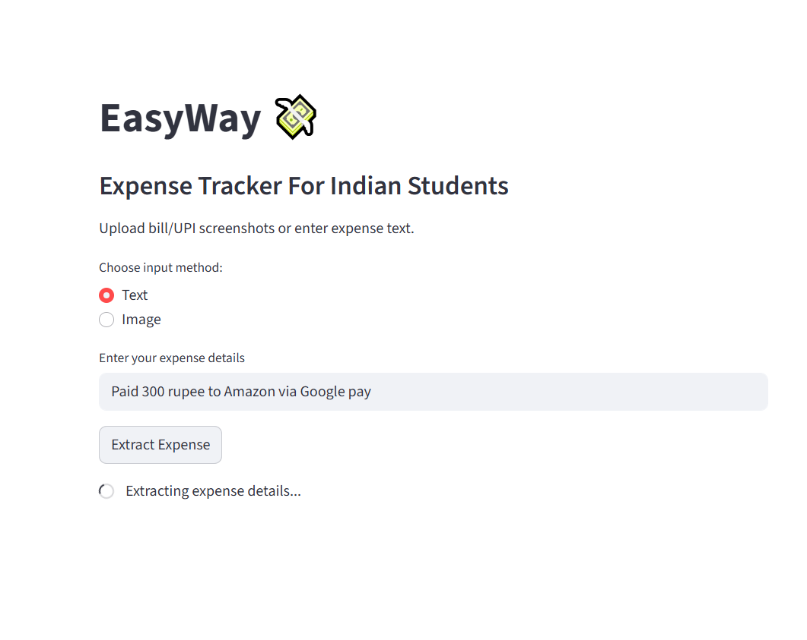
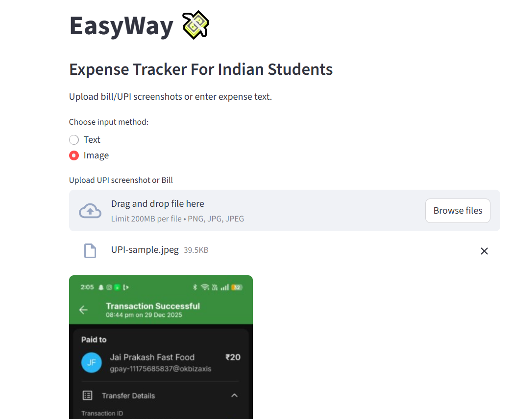

# EASY WAY 

### AI-Powered Expense Tracker for Students

## Overview
**EASY WAY** is an **AI-powered expense tracking** and **budget management system** that extracts expense details from **bills, receipts, and UPI screenshots** and converts them into **structured data** for **easier analysis and management**.

Goal: simplify expense tracking by minimizing manual effort and providing actionable insights.
---

## PROBLEM STATEMENT:

Most students:
* Rely heavily on **UPI and cash** for daily transactions
* Rarely track expenses consistently
* Avoid budgeting because it feels tedious
* Never analyze bills beyond “money gone, pain remains”

Manual expense tracking relies on consistent discipline, which is difficult to maintain. 

EASY WAY reduces manual effort by automating data extraction and categorization.

---

## SOLUTION:

**EASY WAY** automates expense analysis using AI.

### How it works:
1. User uploads a **bill image**, **UPI screenshot**, or enters **text/voice input**
2. The frontend sends data to the backend via API
3. **OCR** extracts raw text from images
4. A **local LLM** interprets the text and identifies expense details
5. Structured expense data is returned
6. Insights are displayed instantly on the frontend

The system eliminates the need for spreadsheets and manual calculations by automating extraction and categorization of expenses .

---
## KEY FEATURES:
* Upload receipts, bills, or UPI screenshots
* Enter expenses using plain text
* AI automatically extracts:
AI automatically extracts:

  * Amount
  * Merchant / Vendor
  * Date
  * Category (with predicted confidence score)
  * Payment mode<br/>
Transactions with low confidence are marked for closer inspection by users. Optional voice-based input for cash expenses is planned for future versions.
---
## What Makes EASY WAY Different?

EASY WAY is built for real-world UPI usage, where transaction screenshots contain noisy OCR data and vendor names are often personal rather than business identifiers.

- Uses **OCR** to extract payment details from UPI screenshots, even when the data is incomplete or messy  
- Applies a **Large Language Model (LLM)** as a reasoning layer to interpret transactions instead of relying on rigid rule-based systems  
- Learns from **user corrections** to build personalized expense categorization over time  
- Assigns a **confidence score** to each prediction, requesting user input only when uncertainty is high


## TECH STACK

### FRONTEND

 **PHASE-I**<br/>
**STREAMLIT:** (Prototype UI) 

* Lightweight, mobile-friendly interface. 

* **Supports:**

  * Image upload
  * Text-based expense entry
* Communicates with backend via REST API  

**Focus:**
Designed for quick and easy data entry.

**PHASE-II**<br/>

**HTML,CSS,JavaScript:**
The frontend is built using **HTML, CSS, and JavaScript**, providing a simple and responsive interface for users to upload UPI screenshots, receipts, and manual expense entries.

**FOCUS:**
- Clean and intuitive UI for quick interaction
- Client-side validation for uploads and inputs
- Seamless integration with the backend API for OCR and AI processing


---

### BACKEND

* **Python + FastAPI**

* **Handles**:

  * API requests
  * OCR processing
  * LLM-based reasoning
  * Structured JSON responses

**Focus:**
Fast and simple API design with clean data flow.

---

## AI Processing Layer

### OCR (Optical Character Recognition)

* Extracts text from uploaded images
* Handles printed and semi-structured receipts
* Powered by **Tesseract OCR**

### Large Language Model (LLM)

* Local **Mistral model** via **Ollama**
* Interprets unstructured text
* Infers missing or unclear information
* Converts raw text into structured expense data
* Assigns confidence scores

**Design Philosophy:**

Uses AI reasoning to interpret data rather than relying on rigid rules.

---

## DATABASE

* **MongoDB** (Planned)
* Not used in the current prototype
* Chosen for:
  * Flexible document structure
  * Scalability
  * Efficient handling of large volume of expence data

---

## TOOLS & DEVELOPMENT ENVIRONMENT:

* **Git** – Version control
* **GitHub** – Repository hosting and collaboration
* **Visual Studio Code** – Primary development environment

---

## SYSTEM WORKFLOW:

1. User submits expense input
2. Frontend sends request to FastAPI backend
3. Backend processes input:

   * OCR (if image)
   * LLM reasoning
4. Structured expense data is generated
5. Results are returned and displayed

## SYSTEM MAIN FLOWCHART:



## AI Processing Flow


---
## DEMO PROTOTYPE:
* Input Text

* Extracted Details
.png)
* Upload bill/UPI Screenshot

* Extracted Details
.png)

---
## Backend API

### Endpoint

**POST `/parse-expense`**

#### Input (multipart/form-data)

* `text` (optional)
* `file` (optional – image)

#### Output (JSON)

```json
{
  "amount": 59,
  "merchant": "Local Shop",
  "category": "Food",
  "date": "2025-01-01",
  "payment_mode": "Cash",
  "confidence": 0.82,
  "reasoning": "Amount inferred from text. Category inferred from keyword."
}
```

---

## How to Run the Project

### Backend

```bash
uvicorn backend.main:app --reload
```

API Docs:

```
http://127.0.0.1:8000/docs
```

---

### Frontend

```bash
streamlit run app.py
```

---

## Limitations

* OCR accuracy depends on image quality
* No persistent storage (yet)
* No authentication or multi-user support
* Prototype-level implementation, not production-ready

---

## Future Enhancements

1. Monthly spending analysis and behavioral insights
2. Overspending prediction and alerts
3. MongoDB integration for persistent storage
4. Multi-user support
5. Social or shared expense features

---

## Authors

* **Swastika Mukherjee**
* **Priyanshi Tamta**
* **Vanshika Maheshwari**
* **Anshika Gaur**

---

## Credits
###Prototype:

* **Vanshika Maheshwari** – Full Stack AI Development
* **Anshika Gaur** – Frontend Development
* **Priyanshi Tamta** – Documentation & Project Management 
* **Swastika Mukherjee** – Overall Contribution and Readme.md files.

###Website:

* **Swastika Maheshwari**-Backend
* **Swastika Mukherjee**- Overall management and management files 
* **Priyanshi Tamta**-Frontend
* **Anshika Gaur**- Project management and Data Flow Diagram

  
